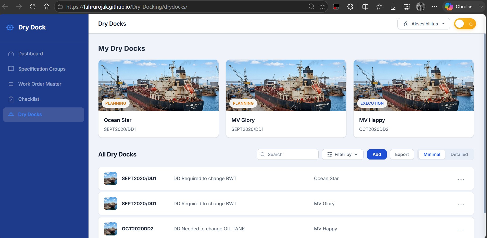
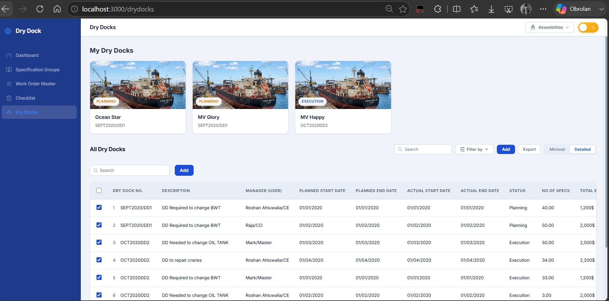
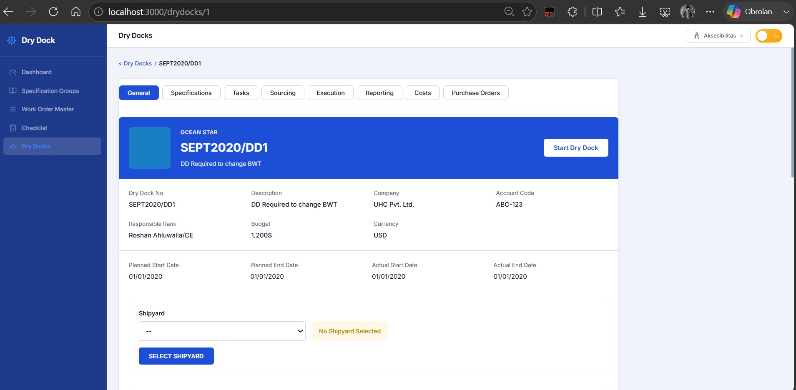

<div align="center">
  <h1>🚢 Dry Docking Management System</h1>
  <p><strong>A Modern, High-Performance Web Application for Managing Dry Docking Operations.</strong></p>
  
  [](https://nuxt.com/)
  [](https://vuejs.org/)
  [](https://www.typescriptlang.org/)
</div>

<br/>

## 📖 Deskripsi Proyek (FRD)

Proyek ini merupakan implementasi ulang (tugas) dari aplikasi operasional *dry docking* asli di industri perkapalan. Dibangun dengan berpegang teguh pada tiga pilar utama *software engineering* profesional:
1. **Clean Structure:** Arsitektur komponen UI dan pemisahan logika yang terstruktur sangat rapi.
2. **Clean Syntax:** Penulisan kode berbasis TypeScript yang sangat mudah dibaca, dikembangkan, dan dipelihara.
3. **High Performance Algorithm:** Pengelolaan status (*state management*) dan manipulasi data yang sangat efisien dan ringan.

---

## ✨ Fitur Utama

| Kategori | Fitur & Fungsionalitas |
| --- | --- |

| **🌗 Tema Adaptif** | Transisi mulus antara **Dark Mode** & **Light Mode**. Setiap elemen tabel, kartu, formulir, dan *dropdown* beradaptasi secara otomatis untuk kenyamanan mata. |
| **♿ Aksesibilitas** | Terdapat menu khusus untuk menyesuaikan **Ukuran Teks** (Normal, Besar, Ekstra) dan mode **Kontras Tinggi** agar mudah dibaca. Preferensi otomatis disimpan. |
| **📊 Tampilan Data** | **Tampilan Ganda:** Mode *Grid Minimalis* untuk ringkasan dan mode *Tabel Detail* untuk analisa (termasuk kolom Budget & Variance). Terdapat fitur filter status (*Planning, Execution*) dan pencarian cepat. |
| **📑 Manajemen Kapal** | Halaman *dashboard* komprehensif per kapal (`/drydocks/[uuid]`) menggunakan sistem tata letak *Multi-Tab* (General, Specifications, Sourcing, Execution, Costs, Reporting). |

---

## 🛠️ Teknologi & Arsitektur Data

> *Proyek ini dibangun secara mandiri tanpa menggunakan framework CSS eksternal (seperti Tailwind atau Bootstrap) demi memastikan kode yang ultra-ringan dan kontrol penuh atas setiap elemen desain.*

- **Frontend:** Nuxt 3 (Vue.js 3, Composition API), TypeScript.
- **Styling:** Vanilla CSS 3 (menerapkan *CSS Custom Properties/Variables*, Flexbox, dan Grid).
- **Backend API:** Server bawaan terintegrasi menggunakan **Nuxt Nitro** (`/server/api/`).
- **Database Lokal:** Memanfaatkan **File-based JSON Database** (`data/drydocks.json`) yang memastikan semua penambahan dan pengubahan data tersimpan secara nyata saat dikembangkan di lokal komputer.
- **Toleransi Kegagalan (GitHub Pages Fallback):** Saat di-deploy ke sistem *Static Hosting* yang tidak bisa menjalankan server Node.js (seperti GitHub Pages), sistem akan dengan pintar mendeteksi terputusnya API dan secara otomatis mengambil alih antarmuka dengan **Data Dummy (Mock Data)**. Situs tetap 100% responsif dan interaktif untuk keperluan demonstrasi/portfolio.

---

## 🚀 Panduan Instalasi (Lokal)

Pastikan komputer Anda telah terinstal **Node.js** (versi 18 atau lebih baru).

```bash
# 1. Buka direktori repositori di terminal
cd Dry-Docking

# 2. Instal semua dependensi wajib
npm install

# 3. Jalankan server pengembangan
npm run dev
```
Setelah server menyala, buka peramban dan kunjungi **`http://localhost:3000`**.

---

## 🌐 Deployment (GitHub Pages)

Repositori ini telah disetel untuk mendukung *deployment* otomatis secara instan.

1. Buka repositori Anda di GitHub lalu masuk ke menu **Settings**.
2. Klik tab **Pages** di sebelah kiri.
3. Pada bagian *Build and deployment*, ubah menu *Source* menjadi **GitHub Actions**.
4. Setiap kali Anda melakukan `git push` ke *branch* `main`, sistem akan otomatis merakit dan mempublikasikan versi terbaru situs web Anda.

---

## 📸 Tangkapan Layar Aplikasi

> **Catatan:** Gambarnya disimpan di `assets/images/` agar otomatis muncul di bawah ini.

<div align="center">

### 1. Halaman Utama (Dashboard)

<br/>*Menampilkan antarmuka utama aplikasi saat diakses, lengkap dengan papan pantau My Dry Docks.*

<br/><hr width="50%"/><br/>

### 2. Detail All Dry Docks

<br/>*Menampilkan daftar seluruh kapal dalam mode tabel lengkap dengan utilitas penyaringan (*filter*) dan pencarian interaktif.*

<br/><hr width="50%"/><br/>

### 3. Detail Kapal Spesifik

<br/>*Menampilkan halaman komprehensif manajemen perbaikan untuk satu kapal beserta ringkasan anggaran, tugas, dan spesifikasi tab.*

</div>
